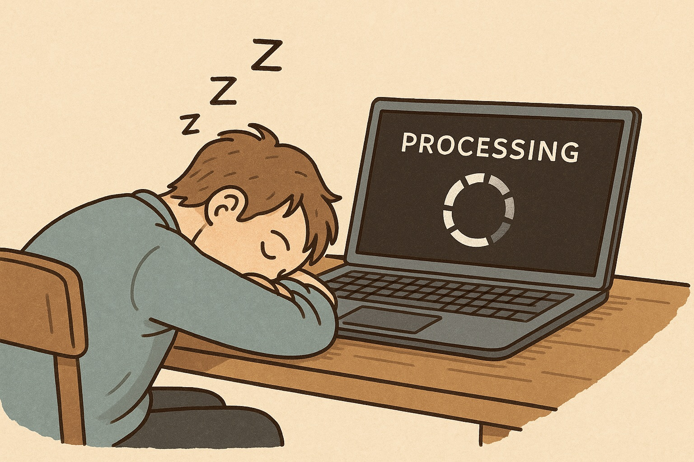

When you run long Julia simulations or heavy computations on a laptop, you don't want your machine to fall asleep in the middle of the job.  
On Windows, macOS, or Linux, the system may suspend itself even if Julia is still crunching numbers — leading to wasted time, broken HTTP calls, or stalled jobs.  

This is the reason [NoSleep.jl](https://github.com/hetalang/NoSleep.jl) exists: a lightweight cross-platform Julia package that prevents your machine from falling asleep during long computations.

## How it works
- **Windows:** uses WinAPI `SetThreadExecutionState`.  
- **macOS:** uses the built-in `caffeinate` tool.  
- **Linux (systemd):** uses `systemd-inhibit`.  

Each backend is safe: once your block finishes (or Julia exits), the inhibitor is released automatically.

## Usage

__Block form__
```julia
using NoSleep

with_nosleep() do
    # Your long computation
end
```

__Keep the display awake too__
```julia
with_nosleep(; keep_display=true) do
    # Your long computation
end
```

## Notes & Side-effects

- Saves you from wasted hours if the OS suspends mid-job. No frustration.

- Useful when running code overnight or unattended.

- Cross-platform: works out of the box on Windows, macOS, and Linux.

- Does not prevent suspend/hibernate when you close the lid or press the laptop's power button — it only blocks automatic idle sleep.

- Feedback and contributions welcome: [GitHub repo](https://github.com/hetalang/NoSleep.jl).