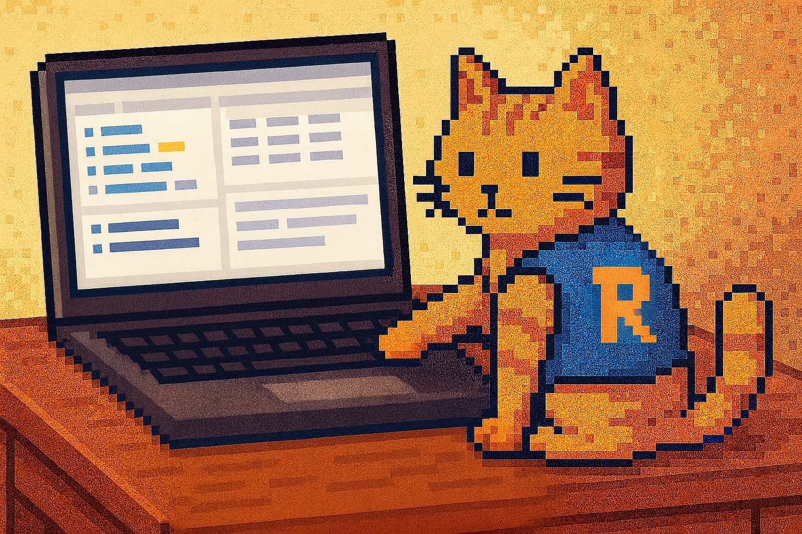

When R runs something heavy for an hour or two, laptops don't always care - many will still go to sleep if there's no user activity.  
On Windows with Modern Standby, on macOS with default power settings, or on Linux with aggressive power-saving policies, this can interrupt work even if R is still busy.

**NoSleepR** solves this problem with a simple idea:  
**keep the system awake only while R is doing something important, and let it return to normal afterward.**

It uses the operating system's official sleep-prevention mechanisms:

- **Windows:** PowerRequest API  
- **macOS:** `caffeinate`  
- **Linux (systemd):** `systemd-inhibit`

No hacks, no fake mouse movement, and no permanent power-plan changes.

## Basic usage

Install from CRAN:

```r
install.packages("NoSleepR")
library(NoSleepR)
```

Turn sleep prevention on manually:

```r
nosleep_on()
# long-running R work here
nosleep_off()
```

Or wrap a block:

```r
with_nosleep({
  # heavy computation here
})
```

If needed, keep the screen awake too:

```r
with_nosleep(keep_display = TRUE, {
  # long-running code
})
```

This is particularly useful on Windows laptops that ignore sleep-prevention when the display turns off in battery mode.

## Why this package exists

Disabling sleep mode globally works, but it's overkill:

- consumes battery even when idle,
- requires changing system settings (sometimes blocked by admins),
- easy to forget to revert.

`NoSleepR` keeps things simple: **only stay awake when the code runs.**

If your workflow calls **C++**, **Rcpp**, **external binaries**, or other **blocking system calls**, they are covered as long as R waits for them to finish.

## What NoSleepR does ΝΟΤ do

Some behaviors are controlled strictly by the OS and cannot be overridden:

- closing the laptop lid forces sleep,
- pressing the power button forces sleep,
- corporate-managed policies may override PowerRequest.

On remote servers, the package does nothing: servers normally do not sleep, and remote session drops are usually network timeouts.

## Practical scenarios

- overnight simulations
- bootstrap or MCMC workflows
- machine-learning training loops
- ETL or data-cleaning pipelines
- unattended scripts on laptops with aggressive sleep policies

If the "YouTube tab" method works for you, `NoSleepR` will work too but without wasting power or being ridiculous.

## Feedback

Bug reports, suggestions, and contributions are welcome:

👉 https://github.com/hetalang/NoSleepR

---

This post is syndicated at [R-bloggers](https://www.r-bloggers.com/).