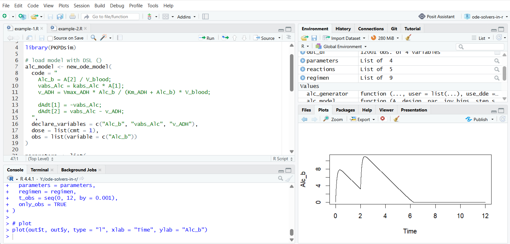
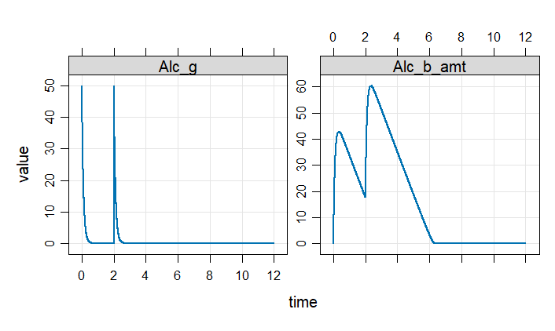
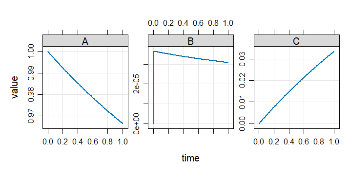

Solving **ordinary differential equations (ODEs)** is a common task in many fields, including systems biology, pharmacometrics, physics, and engineering where dynamic systems are studied. An ODE describes how a variables evolve over time, typically written as 
$$
\begin{align}
\frac{dx_1}{dt} & = f_1\left(t, x_1, x_2, \ldots \right), \\\\
\frac{dx_2}{dt} & = f_2\left(t, x_1, x_2, \ldots \right), \\\\
\vdots & \\\\
\end{align}
$$

The R ecosystem offers a collection of tools for this purpose: from lightweight numerical solvers to full modeling frameworks. This article provides **a practical overview of ODE solvers in R**, with a focus on helping users navigate the ecosystem and choose appropriate tools.

All packages included here were tested with simple examples and the code is available in the [GitHub repository](https://github.com/metelkin/ode-solvers-in-r).

## What is included

We include R packages that:

- Support solving general ODE systems
- Are mentioned in literature, documentation, or community discussions

We intentionally exclude:

- Deprecated or archived packages
- Thin wrappers around other frameworks without original solvers or formats
- Small helper packages
- Proprietary tools with limited public documentation

Some tools included in this review go beyond ODE solving and provide additional capabilities such as parameter estimation or simulation workflows. We include them for completeness, without going into those advanced features.

## Packages overview table

<div class="table-h-scroll">

| Package | Engine | Solver type | Algorithms | Model format | Stiff | DAE | DDE | Time events | Conditional events | Downloads (2025) |
|--------|--------|------|------------|--------------|-------|-----|-----|-------------|--------------------|------------------------|
| [deSolve](https://cran.r-project.org/package=deSolve) | [ODEPACK](http://www.netlib.org/odepack/); [DASPK](http://www.netlib.org/ode/) (Fortran) | Compiled | lsoda, lsode, lsodes, lsodar, vode, daspk, bdf, adams, euler, rk4, ode23, ode45, | R func (interpreted); C/C++/Fortran (compiled) | Yes (lsoda) | Yes (daspk) | Yes (dede) | Yes | Yes (rootfun) | 635628 |
| [dMod](https://cran.r-project.org/package=dMod) | _deSolve_ | Compiled | _depends on deSolve_ | DSL (cOde, compiled), API (compiled)| Yes | - | - | - | - | 4947 |
| [EpiModel](https://cran.r-project.org/package=EpiModel) | _deSolve_ | Compiled | _depends on deSolve_ | R func (interpreted) | Yes | - | Yes (dede) | - | - | 23088 |
| * [IQRTools](https://iqrtools.intiquan.com/doc/book/license-and-availability.html) | [CVODES](https://sundials.readthedocs.io/en/latest/cvodes/index.html) (SUNDIALS) (C) | Compiled | BDF, Adams | DSL (Compiled) | Yes (BDF) | - | - | Yes | - | _NA_ |
| [mrgsolve](https://cran.r-project.org/package=mrgsolve) | [DLSODA](http://www.netlib.org/odepack/) (C++ translation) | Compiled | lsoda | DSL (C++-like, compiled) | Yes | - | - | Yes | - | 33544 |
| [odin](https://cran.r-project.org/package=odin) | _deSolve_ | Compiled | _depends on deSolve_ | DSL (R-like, compiled) | Yes | - | Yes (dede) | - | - | 17252 |
| [PBSddesolve](https://cran.r-project.org/package=PBSddesolve) | [solv95](https://webhomes.maths.ed.ac.uk/~swood34/simon/dde.html) (C) | Compiled | dde | R func (interpreted) | - | - | Yes | - | - | 10341 |
| [PKPDsim](https://cran.r-project.org/package=PKPDsim) | [Boost::odeint](https://github.com/boostorg/odeint) (C++) | Compiled | Adaptive RK (RKCK54) | DSL (compiled) | - | - | - | Yes | - | 10319 |
| [pracma](https://cran.r-project.org/package=pracma) | Matlab-inspired implementation | Pure R | ode23, ode23s, ode45, ode78 | R func (interpreted) | Yes (ode23s) | - | - | - | - | 1059146 |
| [r2sundials](https://cran.r-project.org/package=r2sundials) | [SUNDIALS](https://computing.llnl.gov/projects/sundials) (C) | Compiled | BDF, Adams | R func (interpreted); C++ (compiled) | Yes | Yes (via IDA) | - | - | Yes (via rootfinding) | 3439 |
| [rodeo](https://cran.r-project.org/package=rodeo) | _deSolve_ | Compiled | _depends on deSolve_ | Table format (interpreted / compiled) | Yes | - | - | Yes | Yes (via deSolve roots) | 3386 |
| [rstan](https://cran.r-project.org/package=rstan) | [Stan Math Library](https://mc-stan.org/docs/2_27/functions-reference/functions-ode-solver.html) (C++) | Compiled | rk45, bdf, adams, ckrk | DSL (Stan language, compiled) | Yes (bdf) | Yes (limited, index-1) | - | - | - | 1107167 |
| [rxode2](https://cran.r-project.org/package=rxode2) | [LIBLSODA](https://github.com/sdwfrost/liblsoda) + custom (C) | Compiled | liblsoda, lsoda, dop853, indLin | DSL (R-like, compiled) | Yes | - | - | Yes | - | 42872 |
| [sundialr](https://cran.r-project.org/package=sundialr) | [SUNDIALS](https://computing.llnl.gov/projects/sundials) (C) | Compiled | BDF, Adams | R func (interpreted); C++ (compiled) | Yes | Yes (via IDA) | - | Yes | - | 2024 |
</div>

_\* IQRTools is proprietary; version 99.0.0 is available under AGPL-3.0 and was used in this review._

#### Engine

This refers to the underlying numerical implementation used by the package. This can be:
  - a well-known external library (e.g., ODEPACK)
  - a custom compiled implementation
  - another R package
  - or an external runtime (e.g., another language)

#### Solver type

- **Pure R solvers**: Numerical algorithms implemented directly in R. These are easy to inspect and flexible, but typically slower due to interpreter overhead.
- **Compiled solvers**: Implemented in C/C++/Fortran or wrapping established libraries (e.g., ODEPACK). These provide significantly better performance and are the default choice for most applications.
- **External runtime interfaces**: Packages that delegate computation to external ecosystems such as Julia or Python. These act as bridges rather than standalone solvers.

#### Algorithms
  
This is the list of available numerical methods as documented by the package.

#### Model format

ODE models can be defined in different ways: as R functions, domain-specific languages (DSL), structured APIs, or even external code.

The key distinction affecting performance is how the model is executed:

- **Interpreted execution**: The model is defined as an R function and evaluated during each solver step.
- **Compiled execution**: The model is translated into compiled code before simulation, avoiding interpreter overhead and improving performance.

#### Stiff

Indicates whether the solver can handle **stiff systems**. Stiffness arises when a system contains processes evolving on very different time scales. Solvers that support stiffness typically use implicit methods or adaptive switching (e.g., LSODA).

#### DAE / DDE

Support for these features is solver-dependent and often requires specific algorithms.

- **DAE (Differential-Algebraic Equations)**: Systems that include algebraic constraints in addition to differential equations.
- **DDE (Delay Differential Equations)**: Systems where derivatives depend on past states.

#### Time events / Conditional events

These features are important for modeling real-world systems with discontinuities.

- **Time events**: Discrete changes applied at predefined time points (e.g., dosing events).
- **Conditional events**: Events triggered when a condition is met during simulation (e.g., threshold crossing).

#### Downloads 2025

Total number of downloads in 2025 from CRAN, reflecting usage statistics. Calculated with [CRAN logs](https://cranlogs.r-pkg.org/).

## Repository and test cases

To ensure practical consistency, packages were tested on two simple ODE models. The full code for all packages is available in the companion [GitHub repository](https://github.com/metelkin/ode-solvers-in-r).

We are providing here the code in `mrgsolve` format for two examples: a pharmacokinetic model with non-linear elimination, and the Robertson problem, which is a classic stiff ODE system.

### Example 1: Pharmacokinetic model with non-linear elimination

```r
library(mrgsolve)
library(magrittr)

# load model as DLS (C++ like)
mod <- mcode("pk_model", '
$PARAM
kabs_Alc = 10.0
Vmax_ADH = 3
Km_ADH = 0.1
V_blood = 5.5

$CMT
Alc_g Alc_b_amt

$ODE
double Alc_b = Alc_b_amt / V_blood;
double vabs_Alc = kabs_Alc * Alc_g;
double v_ADH = Vmax_ADH * Alc_b / (Km_ADH + Alc_b) * V_blood;

dxdt_Alc_g = -vabs_Alc;
dxdt_Alc_b_amt = vabs_Alc - v_ADH;

$TABLE
capture Alc_b;
')

# time event
ev1 <- ev(time = 2, amt = 50, cmt = "Alc_g")

# solve
out <- mod %>%
  init(Alc_g = 50, Alc_b_amt = 0) %>%
  ev(ev1) %>%
  mrgsim(start = 0, end = 12, delta = 0.001)

plot(out)
```



### Example 2: Robertson problem stiff ODE

```r
library(mrgsolve)
library(magrittr)

# load model as DLS (C++ like)
mod <- mcode("rob_model", '
$CMT
A B C

$ODE
dxdt_A = -0.04 * A + 1e4 * B * C;
dxdt_B =  0.04 * A - 1e4 * B * C - 3e7 * pow(B, 2);
dxdt_C =  3e7 * pow(B, 2);
')

# solve
out <- mod %>%
  init(A = 1, B = 0, C = 0) %>%
  mrgsim(start = 0, end = 1, delta = 1e-2)

plot(out)
```



## Author's notes

The goal of this review was to provide **a maximally complete and objective overview** of tools for solving ODEs in R. The packages included in this survey differ in their purpose and functionality: from simple numerical solvers to full-featured frameworks and specialized domain-specific tools. Many aspects, such as computational performance, numerical accuracy, and advanced functionality are intentionally not covered in this article.

Many packages designed for specific application areas (e.g., PK/PD) can also be used to solve general ODE systems. These are included here on equal footing, without focusing on their domain-specific features.

Due to the nature of the R ecosystem, most tools that could be systematically reviewed, tested, and compared in a reproducible way are open-source packages.  While several **proprietary engines** also provide ODE-solving capabilities, their internal implementations, numerical methods, and usage are not always publicly documented or accessible without licenses. As a result, they are not included in the main comparison table.

For a broader overview, see the [CRAN Task View: Differential Equations](https://cran.r-project.org/web/views/DifferentialEquations.html).

### Download metrics

The table includes popularity metrics as download counts. However, these numbers do not reflect the actual capabilities of the packages. Downloads may include one-time installations for educational purposes, CI/CD workflows, or usage of a package for non-ODE problems. Therefore, they should not be considered a deciding factor when choosing a tool, but rather as a rough indicator of visibility within the community.

### deSolve

[deSolve](https://cran.r-project.org/package=deSolve) is one of the most widely used and established ODE packages in R. Its central role in the ecosystem is reflected not only in its large user base, but also in the number of other packages that build on top of it.

It provides a broad set of numerical methods and supports a wide range of problem types, including stiff systems, DAEs, DDEs, and event handling. At the same time, it offers flexible model definitions, from simple R functions to compiled code.

Overall, deSolve can be seen as a foundational tool in the R ecosystem for differential equations. Its popularity is well justified by its versatility, stability, and long-term development. If you are new to ODE modeling in R, starting with deSolve is a safe and practical choice before exploring more specialized tools.

### Model formats

An important factor when choosing a tool is the model definition format. The R ecosystem offers a wide range of approaches: from simple R functions (deSolve, pracma, PBSddesolve) and tabular specifications (rodeo) to domain-specific languages (PKPDsim, rstan) and low-level compiled code (rxode2, mrgsolve, deSolve).

These differences affect both performance and usability, and often determine how easily a model can be developed, modified, and integrated into a workflow.

### Limitations and gaps

Despite the variety of available tools, support for some important features remains limited across the R ecosystem. In particular, capabilities such as delay differential equations (DDE), differential-algebraic equations (DAE), and advanced event handling are only partially implemented and are available in relatively few packages. As a result, modeling tasks that rely on these capabilities may require additional effort, careful selection of tools, or even custom implementations.

## Disclaimer

This article will be continuously updated. If you find any inaccuracies or have suggestions, feel free to open an issue:  
https://github.com/metelkin/ode-solvers-in-r/issues
