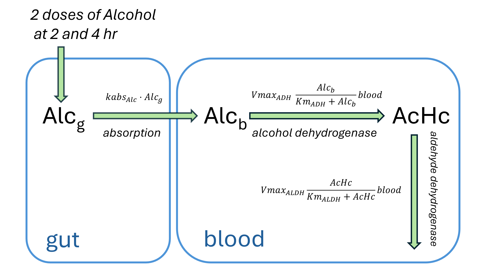

#### Part 1, [Part 2](/model-formats-for-systems-pharmacology-2)

## 1. Intro

Imagine **web development** where every framework has its **own version of HTML**, CSS, and JavaScript. **Git is almost useless**: the project is a mix of binary files and settings hidden in a GUI. **Code can't be reused**: each tool has its own syntax, its own logic, and a closed project file.

Sounds like a bad alternate reality, but this is still how **data storage and exchange** often look in **drug modeling**. Tools solve similar problems, but **model formats** are **incompatible**; project structure is a "black box"; **reproducibility is fragile**; **exchange is painful**.

In this article, we propose looking at a **pharmacological model as code**, and at the model format as an interface between people and tools.

We'll explore:

- what **QSP** is and the role **modeling** plays in **pharmacology**;
- what makes up a QSP model and how **mathematics** turns into **structure**;
- the main approaches to **model description** (ODE scripts, process-based DSLs, tables, visual editors);
- how popular tools **store projects** and where **collaboration** breaks down;
- which software **engineering practices** (layered architecture, testing, CI/CD, semantic diffs) can actually work in QSP;
- how we can improve the situation with **model formats** in QSP.

## 2. Why QSP Matters

Today, **computational biology** and **mathematical modeling** are essential in **drug development** - from early **preclinical experiments** in a test tube to full-scale **clinical trials** in humans. Major **pharmaceutical companies** are investing heavily in this field, hiring top experts in computational biology to streamline the process and make it more effective ([Industry Perspective, JPKPD, 2024](https://doi.org/10.1007/s10928-024-09905-y); [Promotional Submission of QSP, JPET, 2024](https://doi.org/10.1124/jpet.123.001842)).

One of the fastest-growing areas is **Quantitative Systems Pharmacology (QSP)**. In short, QSP builds detailed mathematical models that describe how **drugs** interact with the **human body** and how biological systems respond in return ([NIH QSP White Paper, 2011](https://customsitesmedia.usc.edu/wp-content/uploads/sites/106/2012/12/17062522/NIH-White-Papaer-2011.pdf)).

Think of the human body as a **complex engineered system** - full of components, feedback loops, and regulators. QSP turns this system into math: models that allow pharmacologists, engineers, and statisticians to test drug behavior **virtually** before moving to costly and risky experiments in the lab or clinic. Much like an **aerospace engineer** tests a new airplane in a simulator long before the **first real flight**.

### How QSP Relates to Other Modeling Fields

Long before QSP became a term, **modelers** were already working with related approaches:

- **Systems Biology (SB)** - models networks of **molecules and cells** (typically non-related to drugs or clinical endpoints).
- **Physiologically Based Pharmacokinetics (PBPK)** - models how drugs move through **organs and tissues**, and eliminates from the **body**.
- **Pharmacokinetics/Pharmacodynamics (PK/PD)** - links drug concentration to its **therapeutic effect**, typically **empirically** or by compartmental approach.

QSP didn't appear out of nowhere - it grew out of all three. But it raised the level of detail, scaled up from molecules to **whole-body systems**, and aimed to bridge the gap between mechanism and clinic.

### Why Software Engineers Should Care

From a **developer's perspective**, QSP projects look surprisingly familiar:

- there is **code** (equations, parameters, model structure),
- there are **tests** (validation against clinical or experimental data),
- there are **versions** (models evolve as new data arrives),
- there are **teams** working together on the same project,
- and there are real concerns about **readability**, **reproducibility**, and **maintainability**.

**Drug modeling** is starting to resemble **software engineering** but without the benefit of decades of best practices. That's why ideas like **modularity**, **version control**, **open formats**, and **CI/CD** are so relevant here.

### Current Challenges

For all its **promise**, QSP is still far from smooth sailing. In practice, many QSP teams still run into **systemic challenges**.

- **Teamwork is hard.** Models are often locked inside proprietary tools, making collaboration feel more like passing around **black boxes** than working on shared code.
- **Interpretation is tricky.** Results can be meaningful to insiders, but remain **opaque** to biologists, clinicians, or **decision-makers** who actually need to use them.
- **Reproducibility is fragile.** The same model may give slightly **different results** depending on the tool, environment, or even the person running it.
- **Standards are missing.** Each group develops its own **formats and workflows**, so models **don't travel** well between teams or platforms.
- **Maintenance is painful.** Every new dataset or scientific insight often means heavy, **manual re-work** of existing models.

In short, QSP has the ambition of being an **"engineering discipline for pharmacology"**, but today it still operates with the patchiness and friction of a young science.

## 3. Anatomy of QSP models

In Quantitative Systems Pharmacology, the body is usually represented as a **network of reactions** and interactions across scales—from organs to cells to molecules. Regardless of the level of detail, most models can be broken down into a few common **building blocks**. If we borrow concepts from software engineering, the parallels look like this:

| Concept        | Modeling                                                        | Software analogy             |
| -------------- | --------------------------------------------------------------- | ---------------------------- |
| **States**     | Molecule concentrations, cell counts, organ volumes, biomarkers | Domain states, stored fields |
| **Processes**  | Reactions, transport mechanisms, discrete events                | Business logic               |
| **Parameters** | Organ sizes, blood flows, interaction constants, conditions     | Configuration settings       |
| **Equations**  | Rate laws, transport equations, empirical rules                 | Algorithms                   |
| **Solver**     | ODE integrator running the system dynamics                      | Runtime / execution engine   |
| **Datasets**   | Experimental, clinical, literature data                         | Test data, fixtures, databases |
| **Tasks**      | Dose optimization, prediction, parameter estimation, validation | Use cases, automated tests   |

This mapping isn't perfect, but it highlights a useful perspective: QSP models aren't just collections of equations—they're systems with states, logic, data, and tasks.

### A Simple Example

To make this more concrete, let's look at an example - far smaller than what modelers deal with in practice, but enough to illustrate the **key principles**.

**Fig 1. A toy QSP model of alcohol metabolism.** This minimal example is used to illustrate model structure; real QSP models can include thousands of components and interactions.

In this example, ethanol is consumed twice (state **_Alc_g_**), absorbed into the bloodstream (**_Alc_b_**), metabolized into acetaldehyde (**_AcHc_**), and then further converted into acetate (**_Acet_**).

In ODE form, the model's core dynamics are:
$$
\begin{align}
\frac{d(Alc_g)}{dt} & = -vabs_{Alc},\\\\
\frac{d(Alc_b \cdot blood)}{dt} & = vabs_{Alc} - v_{ADH},\\\\
\frac{d(AcHc \cdot blood)}{dt} & = v_{ADH} - v_{ALDH},\\\\
\frac{d(Acet \cdot blood)}{dt} & = v_{ALDH}.
\end{align}
$$

**where**

$$
\begin{aligned}
vabs_{Alc} & = kabs_{Alc} \cdot Alc_g,\\\\
v_{ADH} & =  \frac{Vmax_{ADH} \cdot Alc_b}{Km_{ADH} + Alc_b} \cdot blood,\\\\
v_{ALDH} & = \frac{Vmax_{ALDH} \cdot AcHc}{Km_{ALDH} + AcHc} \cdot blood.
\end{aligned}
$$

**Fig 2. Demo run of the toy alcohol model.** Results are illustrative and qualitative, not quantitative. Definitely not medical advice (or bartending advice).

### Beyond the Core Equations

In **real-world projects**, the mathematical core is important but just the part of the model. A complete, reproducible modeling package also needs:

- **Annotations** - units, explanations, and key assumptions.
- **Parameter sets & datasets** - conditions, doses, patient characteristics, and data for calibration and validation.
- **Solver settings & metadata** - numerical settings and project history.

Without these and other **metadata**, results are not reproducible, and the model cannot be properly evaluated or reused. Here, we'll keep our focus on the core structure of models rather than all the surrounding layers.

## 4. Popular Tools and How They Store Models

At their core, QSP models are systems of algebraic and differential equations. But the moment we try to implement such a model on a computer, things get trickier. Equations need to be expressed in a very specific way - as functions, arguments, and expressions tailored for a particular programming language or solver.

**Fig 3. Example of raw scripting in Matlab.** Model logic (right) and simulation script (left) live in separate files but are still entangled. The model carries redundant syntax just to satisfy MATLAB and cannot be directly reused in another language or tool. Updating the model code may result in changes in the simulation script.

To make life easier, many tools introduce their own **Domain Specific Languages (DSL)** or rely on **macros**. In essence, we're still writing ODEs, but now they are expressed in a more compact, structured form. This makes the model easier to read and sometimes separates the model description from the execution code - a small but important step toward better clarity and maintainability.

However, this approach still has its drawbacks. As models grow larger, ODE-based code becomes **difficult to maintain**: it resists modularization, and even small changes may require edits in multiple places or restructuring the equations themselves. On top of that, the notation is far from intuitive for biologists or pharmacologists, who tend to think in terms of reactions, metabolites, and pathways rather than ODEs.

**Fig 4. Example of ODE based DSL in mrgsolve.** The model is expressed as a macro-like C++ dialect, which makes it close to the solver and mathematically transparent. The syntax is tool-specific and difficult to parse or convert, limiting portability beyond mrgsolve (and partially NONMEM).

One way around this is the **process-based approach** describing the model in terms of processes that involve metabolites, reactions, compartments and other entities. The software then **generates the ODE** system automatically (e.g., from tables or a custom DSL) right before simulation. This approach reduces manual edits, enables modularity, and lowers the risk of mistakes.  
The trade-off? You need to adjust your modeling mindset. The equation-level view is hidden behind generation, and you need an explicit build pipeline. Still, this method has been influential [SBML](https://sbml.org/) is one example born from such thinking.

To make models even more approachable, some tools offer **visual modeling** showing the model as a map or process graph. Great for accessibility, less so for large-scale version control.

In practice, different tools offer different interaction styles. For small models, it doesn't matter much which you choose. As complexity grows, the differences become critical-impacting **usability, versioning, and collaboration**. For example, comparing two versions, reusing components, or organizing a modular model is often much easier in a process-based DSL than in raw ODE code.

Broadly, user–model interaction falls into these categories:

- **Raw scripting** - Pure code in a **general-purpose language** (MATLAB, Julia, R, Python). Maximum flexibility, minimal standardization. Equations are coded directly; solvers may also be custom-built.
- **Visual modeling** - The user **draws diagrams**, with equations and parameters hidden in annotations (e.g., SimBiology, JDesigner). Great for visualization, poor for Git diffs and mass editing.
- **DSL-based modeling (ODE- or process-based)** - A dedicated **intermediate language**. Balances readability, structure, and flexibility (e.g., mrgsolve, Heta); plus separating the **model layer** from the **execution layer**.
- **Table-based modeling** - The model is defined via **series of spreadsheets**. The idea is similar to a DSL but avoids the need to memorize syntax. Readable, but limited in expressing complex logic.
- **Mixed modeling** - Combinations such as tables + DSL, or tables + diagrams, etc.

**Fig 5. Example of visual modeling in SimBiology.** Visual diagrams make it easier for beginners and biologists to start modeling, but serious work still requires editing mathematical details hidden in tables and formulas. The binary storage format complicates version control and collaboration, while large models quickly become cumbersome as diagrams grow too complex to manage effectively.

### What Ends Up on Disk: Project Storage Formats

Beyond the way models are written (authoring approach), **storage format** matters, especially for collaboration, exchange, and version control. Some platforms store everything in a single file; others use multiple files in different formats. In QSP, storage formats often differ across tools and are rarely interoperable.

Broad storage format categories for QSP:

- **Binary formats** - Not human-readable, hard to diff.
- **Proprietary text formats** - Can be opened in a text editor, but structure is obscure and not meant for manual editing.
- **Structured formats** - Based on open standards (XML, SBML, JSON, YAML). Easier to parse and transform.
- **Human-readable text** - Best for Git and team workflows, but still needs a parser.

The **way you write a model** affects how easy it is to work with, how accessible it is for collaborators, and how reusable the code becomes. The **way you store** a project determines whether it is Git-friendly, easy to compare across versions, and possible to translate into other tools and formats. Both layers matter — and problems often come from confusing or conflating the two.

**Fig 6. Example for process-based DSL. Code for HetaSimulator.** Heta offers a solver- and scripting-independent way to describe models and works well with version control. Support modules and namespaces. However, the format is niche, less familiar to those used to ODEs, and may feel harder to adopt outside its community. Requires a specific [translator](https://hetalang.github.io/hetacompiler) for use across applications.

### Tool Matrix: Authoring, Storage, and Interfaces

QSP has been steadily evolving since **around 2010**. Many of the tools used today originated in neighboring fields such as Systems Biology, PBPK, and PK/PD. Some of them were **adapted** to serve QSP needs, while others were **developed** from scratch.

The table below summarizes key tools in the QSP landscape. Tools are included based on three criteria:
- **Mentioned** in QSP software reviews (i.e. [QSP tools review, CPT-PSP, 2018](https://doi.org/10.1002/psp4.12373))
- **Positioned** as QSP tools in docs or case studies
- **Designed** for solving dynamics, not just auxiliary tasks

| Software          | Interaction mode        | Approach                      | Model/project file format         | Interface                       | Initial scope           |
|-------------------|-------------------------|--------------------------------|------------------------------------|----------------------------------|-----------------|
| [SimBiology](https://www.mathworks.com/help/simbio/index.html)        | Visual, Tables          | Process-based                  | Binary (.sbproj)                   | GUI, Scripting (Matlab)          | SB, QSP         |
| Raw MATLAB        | Raw scripting            | ODE-based                      | Human-readable (.m)                | Scripting (Matlab)               | General purpose |
| [HetaSimulator](https://hetalang.github.io)     | DSL, Tables                | Process-based                  | Human-readable (.heta)             | Scripting (Julia)                | QSP             |
| [Pumas](https://docs.pumas.ai/stable/)             | DSL                        | ODE-based                      | Human-readable (.jl)               | Scripting (Julia)                | PK/PD, QSP             |
| [PK-Sim/MoBi](https://www.open-systems-pharmacology.org/)       | Tables, Visual              | ODE-based                      | Structured (.xml, .pkml)           | Scripting (R)                     | PBPK           |
| [IQR Tools](https://iqrtools.intiquan.com/)         | DSL                        | ODE-based                      | Human-readable (.txt)              | Scripting (R)                     | PK/PD           |
| [mrgsolve](https://mrgsolve.org/)          | DSL                        | ODE-based                      | Human-readable (.mod)              | Scripting (R)                     | PK/PD           |
| [DBSolve](https://sourceforge.net/projects/dbsolve/)           | Mixed: DSL + Tables     | ODE-based                      | Proprietary text (.slv)             | GUI                              | SB              |
| [Berkeley Madonna](https://www.berkeleymadonna.com/)  | Mixed: DSL + Tables     | ODE-based, Process-based       | Proprietary text (.mmd)             | GUI                              | General purpose |
| [SimCYP](https://www.certara.com/software/simcyp-pbpk/)            | Tables                      | ODE-based (*restricted)         | Proprietary text (.wksz)            | GUI, Scripting (R)               | PBPK            |
| [GastroPlus](https://www.simulations-plus.com/software/gastroplus/)        | Tables                      | ODE-based (*restricted)         | Binary (.gpj)                       | GUI                              | PBPK            |
| [Monolix](https://monolixsuite.slp-software.com/monolix/2024R1/)           | Mixed: DSL, Tables                | ODE-based                      | Human-readable (.mlxtran, .txt)     | GUI, Scripting (R, Python)       | PK/PD           |
| [NONMEM](https://www.iconplc.com/solutions/technologies/nonmem)            | Mixed: DSL, Tables                | ODE-based                      | Human-readable (.ctl, .mod)         | CLI, Scripting (PsN/Pirana)     | PK/PD           |
| [JDesigner](https://jdesigner.sourceforge.net/Site/JDesigner.html)         | Visual                           | Process-based                  | Binary (.jdes)                      | GUI                              | SB              |

_\* restricted - limited access to the ODE structure; pre-generated for drug distribution models._

What this comparison actually tells us? Looking across tools, a few patterns stand out:

- **Interoperability gap.** Most ecosystems define their own project and model formats; moving between them usually means partial **rewrites or lossy conversions**.
- **Authoring ≠ storage.** A convenient way to write a model (visual editor, macro DSL) doesn't guarantee a format that's easy to diff, review, or translate. Many tools couple authoring and storage tightly, which **locks projects** to a runtime.
- **Opacity hurts teamwork.** Binary or proprietary text bundles are hard to compare, branch, and merge; they don't play well with **Git, code review, or CI**.
- **Scaling pain**. ODE-centric code **scales poorly**: small structural tweaks (e.g., making a volume dynamic) ripple across many equations. Visual maps don't scale either—large diagrams become navigation mazes.
- **Skill barrier and mental models.** Biologists think in terms of reactions, metabolites, pathways; engineers and solvers consume equations. Many tools **force one side** to work in the other side's mental model.

For teams, this creates a mix of problems: onboarding and **knowledge transfer become slower**, **reproducibility suffers** when parts of the logic are hidden in GUIs or project files, every new dataset or mechanism **increases the cost of changes**, and projects gradually become **locked into** a single vendor's toolset.

The **bigger issue** isn’t the formats themselves, but the **isolation of the communities** that use them. QSP modeling is already demanding: you need biology, math, data, statistics. Few people have the energy to master more than one tool, so most pick one and stay there. **The circle closes**: groups can't share because formats don't match, and formats don't match because each tool is tuned to its own little world. The way out doesn't have to come only from research groups or pharma companies—software **developers can play a big role** in breaking these walls too.

---

**Next: [Part 2: Engineering Practices We Can Borrow](/model-formats-for-systems-pharmacology-2)**