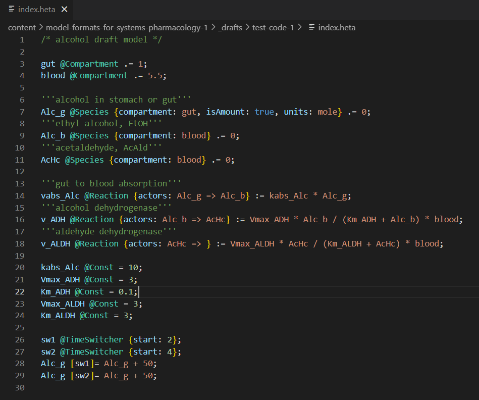

## 1. Intro

Imagine web development where every framework has its own version of HTML, CSS, and JavaScript.
Git is almost useless: the project is a mix of binary files and settings hidden in a GUI.
CI/CD can't be set up: the model doesn't always run from the command line.
Code can't be reused: each tool has its own syntax, its own logic, and a closed "project file".

Sounds like a bad alternate reality, but this is still how model storage and exchange often look in drug modeling. Tools solve similar problems, but model formats are incompatible; project structure is a "black box"; reproducibility is fragile; exchange is painful.

In this article, we propose looking at a pharmacological model as code, and at the model format as an interface between people and tools.

We'll explore:

- what QSP is and the role modeling plays in pharmacology;
- what makes up a QSP model and how mathematics turns into structure;
- the main approaches to model description (ODE scripts, process-based DSLs, tables, visual editors);
- how popular tools store projects and where collaboration breaks down;
- which software engineering practices (layered architecture, testing, CI/CD, semantic diffs) can actually work in QSP;
- how we can improve the situation with model formats in QSP.

## 2. Why QSP Matters

Today, computational biology and mathematical modeling are essential in drug development - from early preclinical experiments in a test tube to full-scale clinical trials in humans. Major pharmaceutical companies are investing heavily in this field, hiring top experts in computational biology to streamline the process and make it more effective [link](https://doi.org/10.1007/s10928-024-09905-y), [link](https://doi.org/10.1124/jpet.123.001842).

One of the fastest-growing areas is Quantitative Systems Pharmacology (QSP). In short, QSP builds detailed mathematical models that describe how drugs interact with the human body and how biological systems respond in return [link](https://customsitesmedia.usc.edu/wp-content/uploads/sites/106/2012/12/17062522/NIH-White-Papaer-2011.pdf).

Think of the human body as a complex engineered system - full of components, feedback loops, and regulators. QSP turns this system into math: models that allow pharmacologists, engineers, and statisticians to test drug behavior virtually before moving to costly and risky experiments in the lab or clinic. These models help researchers:

- predict how a drug will behave under different dosing regimens,
- optimize treatment strategies,
- identify risks before they show up in patients, and
- explain failures in trials by uncovering hidden mechanisms.

In other words, QSP lets you "run" a drug inside a virtual patient - much like an aerospace engineer tests a new airplane in a simulator long before the first real flight.

### How QSP Relates to Other Modeling Fields

QSP sits at the intersection of several established areas:

- Systems Biology (SB) - models networks of molecules and cells non-related to pharmacology.
- Physiologically Based Pharmacokinetics (PBPK) - models how drugs move through organs and tissues.
- Pharmacokinetics/Pharmacodynamics (PK/PD) - links drug concentration to its therapeutic effect, typically empirically.

QSP combines elements of all three, but adds a unique focus on bridging molecular mechanisms with whole-body pharmacology and clinical outcomes.

### Why Software Engineers Should Care

From a developer’s perspective, QSP projects look surprisingly familiar:

- there is code (equations, parameters, model structure),
- there are tests (validation against clinical or experimental data),
- there are versions (models evolve as new data arrives),
- there are teams working together on the same project,
- and there are real concerns about readability, reproducibility, and maintainability.

Drug modeling is starting to resemble software engineering but without the benefit of decades of best practices. That’s why ideas like modularity, version control, open formats, and CI/CD are so relevant here.

### Current Challenges

Despite its potential, QSP as a field still struggles with systemic problems:

- difficulty working in teams and sharing models,
- results that are hard to interpret outside specialized circles,
- poor reproducibility across tools and groups,
- lack of standardization in formats and workflows,
- and the burden of updating or extending models as new data becomes available.

## 3. Anatomy of QSP models

### Core Concepts

In Quantitative Systems Pharmacology (QSP), the human body is typically represented as a network of biochemical reactions and interactions operating across multiple scales - from organs to cells to molecules. Regardless of the level of detail, these systems can usually be described in a common set of core concepts:

- States – Concentrations of molecules, numbers of cells, organ volumes and dimensions, clinical biomarkers.
- Processes – Reactions, transport mechanisms, discrete events.
- Parameters – Organ sizes and flows, molecular properties, interaction constants, masses.
- Equations – Rate laws and transport equations, derived either from mechanistic descriptions or empirical relationships.
- Datasets – Experimental, clinical, or literature data used for model calibration, validation, and testing.
- Tasks – Practical goals for modeling such as dose optimization, treatment prediction, or, internally, parameter estimation, structural identification, verification, and uncertainty analysis.

In most cases, the dynamics of such a system are expressed as a set of ordinary differential equations (ODEs). Given the complexity of biological systems, these models can become extremely high-dimensional. This alone makes the construction, updating, and maintenance of the equations a significant challenge. The exact topology of the system is rarely fixed - it evolves as the project progresses - which means that building such models requires dedicated workflows involving iterative refinement, validation, and testing.

If we borrow concepts from software engineering, we can draw parallels between a QSP model and application architecture.

- Model States are akin to domain states or stored fields.
- Processes map to business logic.
- Equations resemble specific algorithms.
- Parameters function like configuration settings.
- The ODE solver plays the role of a runtime or execution engine, "running" the model.
- Tasks are comparable to use cases or automated test scenarios.

The analogy isn't always perfect, but it highlights a useful perspective: there may be untapped opportunities to improve how we develop and maintain QSP models by borrowing proven practices from software engineering

### A Simple Example

To make this more concrete, let's look at a highly simplified example - far smaller than what modelers deal with in practice, but enough to illustrate the key principles. For simplicity, we omit more advanced features such as dynamic volumes, flows, delays, complex branching reactions, and conditional events.

Imagine a minimal model of alcohol metabolism in the human body (Fig. 1):

**Fig 1.** Scheme of a minimal model for alcohol metabolism.

In this example, ethanol is consumed twice (state Alc_g), absorbed into the bloodstream (Alc_b), metabolized into acetaldehyde (AcHc), and then further converted into acetate (Acet).

In ODE form, the model's core dynamics are:
$$
\begin{align}
\frac{d(Alc_g)}{dt} & = -vabs_{Alc},\\\\
\frac{d(Alc_b \cdot blood)}{dt} & = vabs_{Alc} - v_{ADH},\\\\
\frac{d(AcHc \cdot blood)}{dt} & = v_{ADH} - v_{ALDH},\\\\
\frac{d(Acet \cdot blood)}{dt} & = v_{ALDH}.
\end{align}
$$

The system also includes rate laws, parameter values, initial conditions, and discrete dosing events:

Rate laws (rules expressing concentration income/outcome):

$$
\begin{aligned}
vabs_{Alc} & = kabs_{Alc} \cdot Alc_g,\\\\
v_{ADH} & =  \frac{Vmax_{ADH} \cdot Alc_b}{Km_{ADH} + Alc_b} \cdot blood,\\\\
v_{ALDH} & = \frac{Vmax_{ALDH} \cdot AcHc}{Km_{ALDH} + AcHc} \cdot blood.
\end{aligned}
$$

Parameter values (constants defining the fixed properties of the system):

$$
\begin{aligned}
& gut = 1, blood = 5, \\\\
& kabs_{Alc} = 0.1, \\\\
& Vmax_{ADH} = 0.5, Km_{ADH} = 0.1, \\\\
& Vmax_{ALDH} = 0.5, Km_{ALDH} = 0.1.
\end{aligned}
$$

Initial conditions (initial amounts/concentrations at time zero)

$$
\begin{aligned}
& Alc_g\left(0\right) = 0, \\\\
& Alc_b\left(0\right) = 0, \\\\
& AcHc\left(0\right) = 0, \\\\
& Acet\left(0\right) = 0.
\end{aligned}
$$

Dosing events (discrete inputs to the system at specific times):

$$
\begin{aligned}
Alc_g\left(2\right) &\leftarrow Alc_g\left(2\right) +0.2,\\\\
Alc_g\left(4\right) &\leftarrow Alc_g\left(4\right) +0.2.
\end{aligned}
$$

**Fig 2.** Simulation results for the alcohol metabolism model. Note that results are based on the random approximate parameters and do not display the real dynamics.

### Beyond the Core Equations

In real-world projects, the mathematical core is important but just the part of the model. 
A complete, reproducible modeling package also needs:

1. Structured annotations - explanations, limitations, and assumptions of model parts.
2. Input parameter sets describing specific conditions, doses, or patient characteristics.    
3. Solver settings - the numerical methods and parameters used for ODE integration.
4. Datasets for calibration, validation, and testing.
5. Protocols for complex simulation workflows such as confidence interval estimation, sensitivity analysis, or uncertainty quantification.
6. Metadata - version history, authorship, run logs, and so on.

Without these, results are not reproducible, and the model cannot be properly evaluated or reused.

Most modeling environments describe the model core in some form of equations and parameters, though with varying constraints. 
Some tools employ macro languages, domain-specific languages (DSLs), or graphical editors to simplify model creation. 
However - and this is the critical point - the underlying structures and storage formats vary widely between tools, 
there is no common standard, and auxiliary information is not always saved or cleanly separated from the model code.

In the next section, we'll see how the same model can look dramatically different across popular QSP tools 
and why that matters for both modelers and developers.

## 4. Popular Tools and How They Store Models

### Interaction Modes: How Users Author Models

A mathematical model built on algebraic–differential equations is straightforward for mathematicians and modelers.  
But working with it directly? Not so much.  

**Fig 3.** Example of raw scripting in Matlab. Code divided to model part and runnable script.

For a computer program to use it, the model needs a structured markup language and parsers to read it.  
For biologists or pharmacologists-who may also be involved-it's even harder to interpret raw equations.

There's another practical challenge:  
ODE-based notation works fine for solvers, but if you introduce a complex reaction involving multiple metabolites, you often have to update several right-hand sides or add multiple new equations. This quickly becomes messy and error-prone.

One way around this is the **process-based approach**-describing the model in terms of processes that involve metabolites and other entities. The software then generates the ODE system automatically (e.g., from tables or a custom DSL) right before simulation. This approach reduces manual edits, enables modularity, and lowers the risk of mistakes.  
The trade-off? You need to adjust your modeling mindset. The equation-level view is hidden behind generation, and you need an explicit build pipeline. Still, this method has been influential-[SBML](https://sbml.org/) is one example born from such thinking.

To make models even more approachable, some tools offer **visual modeling**-showing the model as a map or process graph. Great for accessibility, less so for large-scale version control.

In practice, different tools offer different interaction styles. For small models, it doesn't matter much which you choose. As complexity grows, the differences become critical-impacting usability, versioning, and collaboration. For example, comparing two versions, reusing components, or organizing a modular model is often much easier in a process-based DSL than in raw ODE code.

Broadly, user–model interaction falls into these categories:

- **Raw scripting** - Pure code in a general-purpose language (MATLAB, Julia, R, Python). Maximum flexibility, minimal standardization. Equations are coded directly; solvers may also be custom-built.
- **Visual modeling** - The user draws diagrams, with equations and parameters hidden in annotations (e.g., SimBiology). Great for visualization, poor for Git diffs and mass editing.
- **DSL-based modeling** - A dedicated intermediate language. Balances readability, structure, and flexibility (e.g., HetaSimulator).
- **Table-based modeling** - The model is defined via spreadsheets or tabular formats. Readable, but limited in expressing complex logic.
- **Mixed modeling** - Combinations such as tables + DSL, or tables + diagrams.

**Fig 4.** Example of visual modeling in SimBiology

### What Ends Up on Disk: Project Storage Formats

Beyond authoring style, storage format matters-especially for collaboration, exchange, and version control.  
Some platforms store everything in a single file; others use multiple files in different formats. 
In QSP, these formats are usually incompatible.

**Fig 5.** Example of ODE based DSL (macros) in mrgsolve

Broad storage format categories:

- **Binary formats** - Not human-readable, hard to diff.
- **Proprietary text formats** - Can be opened in a text editor, but structure is obscure and not meant for manual editing.
- **Structured formats** - Based on open standards (XML, SBML, JSON, YAML). Easier to parse and transform.
- **Human-readable text** - Best for Git and team workflows, but still needs a parser.

A major step forward for modeling communities was **SBML** [link](https://doi.org/10.1515/jib-2017-0081), which standardized machine-readable model exchange. 
It enabled smoother tool integration and collaboration-but it's still an exchange format, not a project-editing format. 
It also doesn't address QSP-specific needs.

Other domain formats exist-SED-ML (simulation tasks) [link](https://doi.org/10.1186/1752-0509-5-198), 
COMBINE archives (project packaging) [link](https://doi.org/10.1186/s12859-014-0369-z), 
PETAB (experiment parameterization) [link](https://doi.org/10.1371/journal.pcbi.1008646) but they see limited adoption for QSP.

### Tool Matrix: Authoring, Storage, and Interfaces

QSP has been evolving since around 2010. Many of its tools are adapted from related fields:  
Systems Biology (SB), Physiologically Based Pharmacokinetics (PBPK), and Pharmacokinetics/Pharmacodynamics (PK/PD).  
Some were retooled for QSP; others are brand new.

**Fig 6.** Example for process-based DSL. Code for HetaSimulator

Criteria for inclusion here:
- Mentioned in QSP software reviews ([link](https://doi.org/10.1002/psp4.12373))
- Positioned as QSP tools in docs or case studies
- Designed for solving dynamics, not just auxiliary tasks

| Software          | Interaction mode        | Approach                      | Model/project file format         | Interface                       | Initial scope           |
|-------------------|-------------------------|--------------------------------|------------------------------------|----------------------------------|-----------------|
| [SimBiology](https://www.mathworks.com/help/simbio/index.html)        | Visual, Tables          | Process-based                  | Binary (.sbproj)                   | GUI, Scripting (Matlab)          | SB, QSP         |
| Raw MATLAB        | Raw scripting            | ODE-based                      | Human-readable (.m)                | Scripting (Matlab)               | General purpose |
| [HetaSimulator](https://hetalang.github.io)     | DSL, Tables                | Process-based                  | Human-readable (.heta)             | Scripting (Julia)                | QSP             |
| [Pumas](https://docs.pumas.ai/stable/)             | DSL                        | ODE-based                      | Human-readable (.jl)               | Scripting (Julia)                | PK/PD, QSP             |
| [PK-Sim/MoBi](https://www.open-systems-pharmacology.org/)       | Tables, Visual              | ODE-based                      | Structured (.xml, .pkml)           | Scripting (R)                     | PBPK           |
| [IQR Tools](https://iqrtools.intiquan.com/)         | DSL                        | ODE-based                      | Human readable (.txt)              | Scripting (R)                     | PK/PD           |
| [mrgsolve](https://mrgsolve.org/)          | DSL                        | ODE-based                      | Human-readable (.mod)              | Scripting (R)                     | PK/PD           |
| [DBSolve](https://sourceforge.net/projects/dbsolve/)           | Mixed: DSL + Tables     | ODE-based                      | Proprietary text (.slv)             | GUI                              | SB              |
| [Berkeley Madonna](https://www.berkeleymadonna.com/)  | Mixed: DSL + Tables     | ODE-based, Process-based       | Proprietary text (.mmd)             | GUI                              | General purpose |
| [SimCYP](https://www.certara.com/software/simcyp-pbpk/)            | Tables                      | ODE-based (*restricted)         | Proprietary text (.wksz)            | GUI, Scripting (R)               | PBPK            |
| [GastroPlus](https://www.simulations-plus.com/software/gastroplus/)        | Tables                      | ODE-based (*restricted)         | Binary (.gpj)                       | GUI                              | PBPK            |
| [Monolix](https://monolixsuite.slp-software.com/monolix/2024R1/)           | DSL, Tables                | ODE-based                      | Human-readable (.mlxtran, .txt)     | GUI, Scripting (R, Python)       | PK/PD           |
| [NONMEM](https://www.iconplc.com/solutions/technologies/nonmem)            | DSL, Tables                | ODE-based                      | Human-readable (.ctl, .mod)         | CLI, Scripting (PsN/Pirana)     | PK/PD           |
| [JDesigner](https://jdesigner.sourceforge.net/Site/JDesigner.html)         | Visual                           | Process-based                  | Binary (.jdes)                      | GUI                              | SB              |
| PhysioLab by Enthelos        | DSL                        | ODE-based                      | Proprietary text(.phl)              | GUI                              | QSP             |

_\* restricted - limited access to the ODE structure; pre-generated for drug distribution models._

Although these tools solve similar problems, their formats are rarely compatible.  
Switching often means rewriting models from scratch or doing painful manual conversions.  
Most tools store states, equations, parameters, data, and tasks all together-making modular reuse and Git-based workflows difficult. 
In DevOps terms, this is a serious bottleneck for CI/CD in model development.
