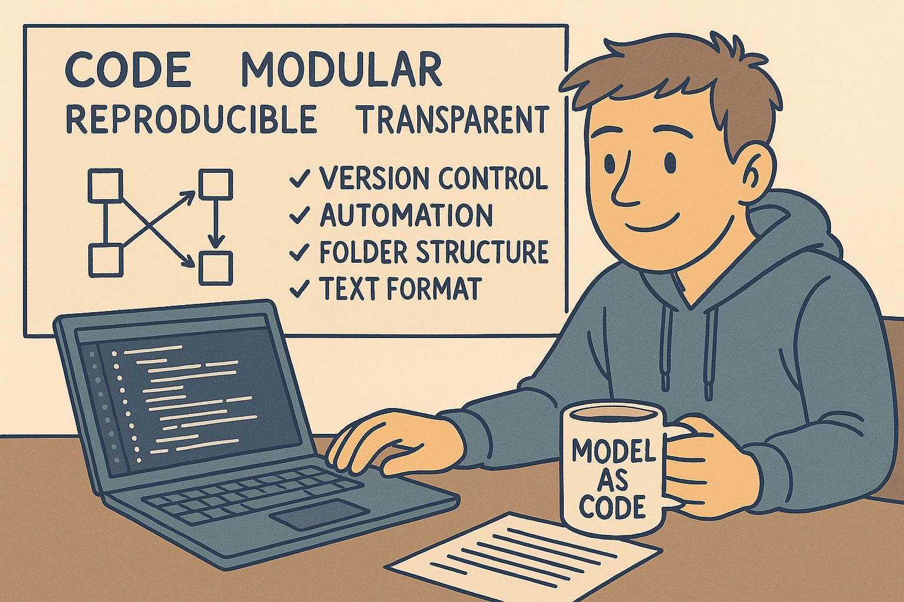
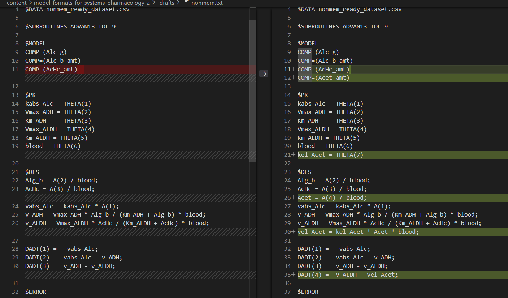
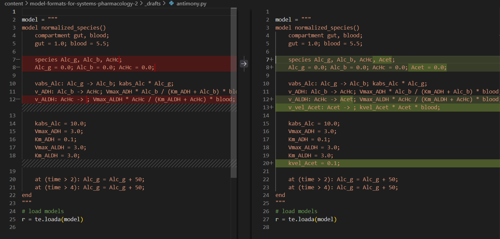
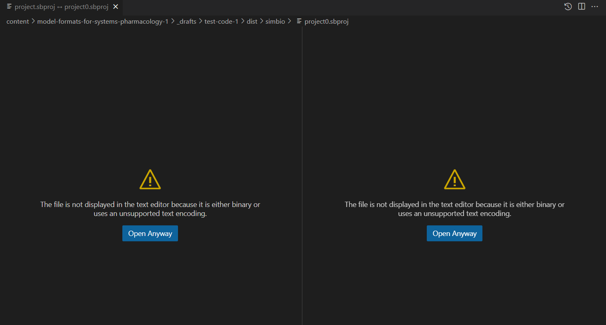
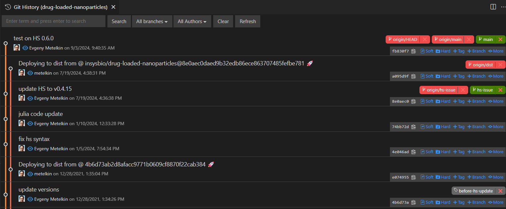
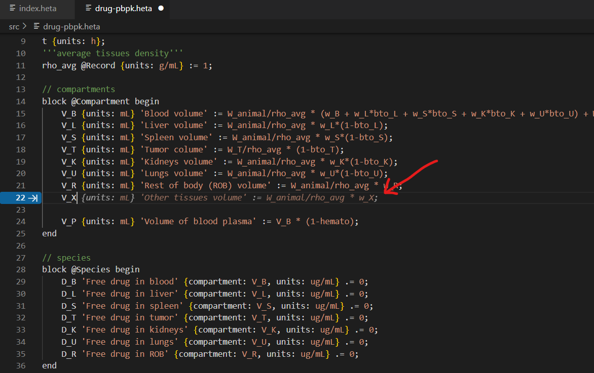

[Part 1](/model-formats-for-systems-pharmacology-1), **Part 2**



_In [Part 1](/model-formats-for-systems-pharmacology-1), we looked at the landscape of QSP model formats—their origins, strengths, and limitations. In this follow-up, I want to step back and explore the problem from a software engineering perspective: what practices and design principles could make QSP modeling more transparent, modular, and reproducible, and how model formats can evolve to support that shift._

## 5. Model as code

In software, the “X as code” idea has proven itself many times over—**Infrastructure as Code** ([Terraform](https://developer.hashicorp.com/terraform/tutorials/aws-get-started/infrastructure-as-code)), **Configuration as Code** ([Ansible](https://www.redhat.com/en/blog/ansible-automation-platform-2.3-configuration-as-code-improvements)), and **Pipeline as Code** ([Jenkins](https://www.jenkins.io/doc/book/pipeline/jenkinsfile/)), among others. The core idea is simple: we don’t just manage **artifacts** (infrastructure, configuration, pipelines) directly—we manage their **textual representation** under version control, even if those artifacts were never treated as “code” before. In all cases, the **authoritative source** (canonical source for other forms) is human-readable text. This doesn’t exclude working with diagrams or tables—authoring can stay visual or interactive, but the canonical format must still be code. This shift brought massive gains in transparency, modularity, and reproducibility, and accelerated progress in software engineering.

If we look back at the popular formats discussed earlier, not all of them can be considered model as code. Some are well-suited; others are not. QSP formats that are stored in binary or tool-specific project files cannot be treated as code. Formats that are formally “text-based” but too complex or unstructured for a human to read or write also only partially fit this concept.

When this principle is in place, modelers gain access to an entire ecosystem of tools: version control, diff and merge utilities, code completion, automated testing, and CI/CD pipelines. Nothing needs to be reinvented—these are the same practices that software engineers already use. It means versioned, testable, modular, and reusable models.

In practice, a model becomes more than a loose collection of files: it turns into a full engineering project with a clear folder structure, documentation, and automation. This approach improves reproducibility, makes validation and review more systematic, and simplifies onboarding new team members.

### Code Transparency

**Code transparency** means that every aspect of a model is visible, reviewable, and understandable at a glance. This covers not only the model structure, but also the equations, parameters, and the assumptions embedded within it. A transparent format allows collaborators to see what exactly the model does without needing the original author or a proprietary tool to “explain” it.

A second requirement is traceable change. Transparency is not only about being able to read the code, but also about being able to see what changed and why between versions. With text-based formats, differences are captured by standard tools (e.g., Git diff), making version control, peer review, and collaboration far more effective.


_**Fig. 1. Traceable change for NONMEM model file.** Comparison in VSCode. Can see changes clearly._

A desirable (not strictly mandatory) requirement is self-explanatory code. This means that the model description carries enough context—through clear naming, annotations, and units—that a new reader can understand the intent without constantly referring back to external notes or publications. While not every project achieves this ideal, self-describing code lowers the entry barrier for new collaborators, reduces misinterpretation, and makes the model more resilient to staff turnover or long gaps between updates.


_**Fig. 2. Self-explanatory code trace in Antimony modeling language.** Comparison in VSCode. Model diff meaning easy to understand at a glance because of clear syntax._

By contrast, QSP environments that store models in binary, closed, or otherwise non-readable formats cannot ensure transparency. They block the very practices—review, versioning, collaboration—that modern scientific software relies on. Even when dedicated comparison tools exist, they are typically ad-hoc, tied to a single platform, and rarely integrate smoothly into a team’s normal project workflow. As a result, they are used sporadically and do not replace true text-level transparency.


_**Fig. 3. Non traceable change for SimBiology project.** Comparison in VSCode. Model change cannot be tracked in file comparison._

### Modularity

**Modularity** is the ability to divide a project into independent parts that can be developed, tested, and reused separately. It comes from having clear interfaces and well-defined dependencies between components.

Here we use the term broadly: it includes both the **separation of different project layers**—model, data, scripts (covered in more detail in the Separation of Concerns section)—and the internal modularization of the model itself into subcomponents that are easier to manage and understand.

What modularity brings:

- **Code reuse.** Modules can be packaged and reused across projects or systems, avoiding copy-paste and enabling larger blocks to become shared dependencies.
- **Clarity and maintainability.** Smaller, self-contained pieces are easier to read, document, and hand over to new collaborators.
- **Scalability.** Adding a new drug, pathway, or dataset means extending the project with a module rather than rewriting existing code.
- **Experimentation and flexibility.** Alternative implementations (e.g., two different PK models) can be swapped or compared without touching the rest of the system.

The more logically a QSP platform is divided into modules, the easier it becomes to manage the work and distribute responsibilities. A single monolithic “black-box” file forces the entire team to work sequentially, rather than in parallel.

### Longevity

**Longevity** means that a model remains usable and trustworthy years after it was first created. Instead of “remembering which buttons we clicked,” the project can be rebuilt, rerun, and revalidated from its source.


_**Fig. 4. Git commit history in QSP project.**: Commit history provides a timeline of changes in branches, enabling easy rollback and review._

What makes longevity possible:

- **Version history.** With Git or similar systems, projects can be saved as a sequence of working snapshots. Each commit captures the state of parameters, equations, and scenarios at a given moment, creating a project timeline that can be revisited or rolled back when needed.
- **Environment capture.** Pinned dependencies and solver settings (e.g., Project.toml, requirements.txt, renv.lock) ensure the same model can be executed in the future, regardless of local updates.
- **Readable formats.** Text-based models outlive specific tools; even if a GUI disappears, the core code can still be read, parsed, and converted.
- **Re-validation.** As new data or regulatory requirements arise, archived models can be rerun and checked against updated knowledge.
- **Knowledge preservation.** Annotations, comments, and documentation carry context, so understanding does not depend on the original author’s memory.
- **Regulatory and audit needs.** Long-term reproducibility is critical for submissions: teams must show exactly what model was used to support a decision at a given time.

Longevity turns a QSP model from a one-off experiment into a sustainable scientific asset—something that can be reliably shared, revisited, and built upon.

### Automation

**Automation** means that models are executed and tested through scripts instead of manual clicks. Once a model is code, it can be integrated into pipelines that ensure consistent, repeatable runs for simulations, parameter estimation, or sensitivity analyses.

With CI/CD, every commit can automatically launch validation tasks, generate reports, or even dispatch heavy computations to a more powerful server or cluster. This reduces human error, scales effortlessly, and makes QSP projects more reliable and collaborative.

### LLM & AI

When models are stored as readable code, they become accessible not only to people but also to AI assistants. This opens new opportunities for collaboration between modelers and large language models.


_**Fig.5. Autocompletion for Heta code.** GitHub Copilot can assist with code suggestions and completions if the model has unified and clear structure. Red arrow points to the suggestion._

- **Assisted modeling.** Existing tools like GitHub Copilot or Cursor can already be used with QSP models stored as code—offering chat-based assistance, code generation, or autocompletion in Domain-Specific Language (DSL)/Macros/JSON, just as they do today for Python or R scripts.
- **Report integration.** Because the model is code, the same source can be used to draft reports—summaries of changes, simulation results, or documentation—linked directly to the version history.
- **Model as knowledge base.** A structured repository can serve as a living knowledge base for LLMs. By indexing models and metadata, teams can query them conversationally (“how is clearance modeled here?”) or connect them with external literature for reasoning.
- **Automated generation.** Beyond code completion, LLMs could be used to generate entire model fragments or even full models from structured descriptions, project specifications, or natural-language prompts. For example, a developer might design a tool that takes a pathway description or a clinical protocol and produces a ready-to-run QSP model.

Used carefully—with validation, tests, and human review—AI support can turn QSP models into more interactive, transparent, and productive assets, while preserving scientific rigor.

By contrast, if the model exists only as a binary project and the GUI is the only interface, none of these benefits are available: assistants cannot read or suggest code, generation and reporting are manual, and the project remains a closed box.

## 6. Separation of Concerns

**Separation of Concerns** is a principle borrowed from software engineering. Applied to QSP, it means treating each aspect of a project as its own layer with clear boundaries and contracts. The model is not the data. The runtime is not the source. When these lines blur, projects become harder to read, validate, and reuse. When they are explicit, projects stay modular, and easier to evolve.

Layers (at a glance)

- **Model** — description of system, biological processes: structure, equations, annotation.
- **Scenarios** — in-silico experiment conditions: dosing, schedules, observables, simulation horizons, parameter variations.
- **Data** — experimental/clinical datasets, raw or statistical data.
- **Tasks** — computational actions (simulate/fit/sensitivity/identifiability) referencing Model/Scenarios/Data.
- **Solver config & Environment** — numerical settings plus lockfiles/containers (library and OS versions).
- **Runtime/Engines** — applications, solvers and interfaces.
- **Pipelines & Notebooks** — automation (CLI/CI/CD) and interactive analysis (Jupyter/Quarto).
- **Results/Reports** — outputs, logs, and report artifacts (generated by pipelines; not hand-edited).
- **Docs/Metadata** — general annotations, assumptions, references, ontologies.

This is a fairly fine-grained breakdown for illustration. In real projects, separation can take different forms: dedicated folders, individual files, or clear structural sections inside one file in some cases. The key is that layers stay distinct, not mixed.

Another point is that each layer carries **its own logic and conventions**. A sensitivity-analysis script has very different requirements than a model structure. Automation may rely on technologies with its own style of configuration. Forcing everything into a monolithic structure only makes projects fragile.

The idea is familiar from software engineering: web applications separate frontend, backend, and database; frameworks use MVC or MVVM patterns. QSP projects benefit from the same discipline: each layer does its job, connected by explicit interfaces rather than hidden assumptions.

### Project Structure

A practical way to implement "Separation of Concerns" is through a **clear and consistent project structure**. When each layer has its own dedicated place, the project becomes easier to navigate, test, and extend. In other words, the folder layout itself enforces modularity and discipline:

```
qsp-project/
  model/          # core structure: states, reactions, equations
  data/           # measurements for calibration/validation
  scenarios/      # description of experimental conditions and parameters
  docs/           # General purpose annotations, assumptions, limitations, references for the whole project
  results/        # outputs, logs, reports (generated, not hand-edited)
  julia/          # Julia code for simulation and analysis
  R/              # R code for simulation and analysis
  project.yml     # machine-readable top-level metadata, dependencies, configuration
  README.txt      # human-readable overview and instructions
```

Such a layout makes a QSP project behave like any other **modern software repository**: modular, reviewable, and easy to share. The exact structure may vary depending on how well the project can be split into layers, which tools are in use, and the team’s workflow. The key is not the specific folder names, but that the structure is **consistent, agreed upon, and understood** by everyone on the team. This shared and long-term convention reduces friction, improves collaboration, and ensures that new members can quickly find their way around the project.

These additional principles make project structures more robust:

- **Keep the repository clean.** The project folder should only contain what is essential: model code, data, scenarios, tasks, configuration, and documentation. Avoid bundling software installers, outdated model versions, or random drafts and unused scripts. Such clutter makes navigation harder and undermines clarity. Version control (Git) and artifact registries are the right place for history and distributions.

- **Single source of truth.** Everything required to run or reproduce the project must either be part of the repository or referenced in a reliable, long-term way. No ambiguous dependencies on “files somewhere on a laptop” or “datasets hidden in a presentation.” If a script was written for the project, it should live in the project. If external data cannot be included directly, it must be referenced with a stable identifier or DOI and clear provenance. This ensures reproducibility and integrity over time.

- **Stable naming and references.** Avoid renaming files, folders, or key identifiers without a strong reason. Frequent or unnecessary renames break links, confuse collaborators, and make version history harder to follow. Stable names act as anchors for scripts, pipelines, and external references, ensuring continuity and trust in the project’s structure.

- **Documentation as code.** Documentation should live alongside the project and evolve together with it. Assumptions, references, and instructions belong under version control, not in scattered slides or personal notes. Keeping docs close to the source makes them reviewable, traceable, and always in sync with the current state of the project.

### Model Layout (keep layers separate but linked)

**Why this matters.** Data scientists have long kept data in tabular, diff-friendly formats (CSV/TAB/Parquet) and code in versioned scripts (R/Julia/Matlab/Python). The persistent gap in QSP is the model layer: when a model has no canonical, human-readable source, you can’t reliably diff or review changes, and you can’t automate validation. Everything downstream—reproducibility, CI, and collaboration—degrades.

"Model as code" principle treats the model as a **declarative artifact** with its own lifecycle. The source of truth is text. GUIs, notebooks, and binaries are authoring or execution surfaces, not the canonical store. This simple rule unlocks code review, versioning, composition, and automation for the model layer exactly as it does for code and data.

**Contracts: how layers talk.** When the model is kept separate from the rest of the project, it needs a clear way for other layers to reference it. Scenarios, tasks, and datasets should point to model elements through explicit identifiers—states, parameters, events, or observables in namespaces—rather than by position, file order, or ad-hoc labels. These references must be validated automatically, with pipelines configured to fail fast if an ID is missing or renamed. Stability here does not mean immobility, but transparent, predictable evolution. 

**Modularity at the model level.** A practical layout, if your tools support a DSL or modular model files, might look like this:

```
model/
  core.dsl          # base states/params/eqs
  pk.dsl            # PK submodule (imports core)
  pd.dsl            # PD submodule
  cell-dynamics.dsl # cell dynamics submodule
  index.dsl         # top-level file that composes/exports modules
```

When available, this approach has clear advantages: each file has a narrow, stable responsibility; imports and namespaces let you compose submodels cleanly; and a single **index** provides the surface for downstream layers to import. This makes reuse straightforward—modules can be copied or version-pinned across repositories instead of duplicating whole projects. Even if your current environment doesn’t provide such modularity, aiming for stable paths, explicit IDs, and a clear separation of responsibilities will bring similar benefits and reduce churn that breaks links or history.

**Tooling for the model layer.** The model layer benefits from having its own basic checks, just like data or code. At minimum, tools should confirm that equations are dimensionally consistent, that all references point to something that exists, and that every state or parameter is defined only once. It helps to run quick “sanity” simulations on each update to confirm the model still produces reproducible results. These lightweight checks make errors visible early and keep the model trustworthy as it grows.

**Authoring & round-trip workflow.** You can build or edit a model wherever it’s convenient—through a GUI, a notebook, or even a helper script. What matters is that the final result is always saved back into a clear, text-based format. That text is what goes under version control, what reviewers look at, and what other tools check for errors. This way modelers stay free to use familiar interfaces, while the project still keeps a consistent, transparent record.

### Roles & Handoffs (who edits which layer)

Different specialists can work productively when boundaries are explicit.

- **Model Engineer (biology focused).** Owns Model + Scenarios. Delivers: validated model modules, annotations, units.
- **Biostatistician / Data Manager (data analysis focused).** Owns Data and results. Delivers: cleaned datasets with units and provenance.
- **Simulation Engineer (computational methods focused).** Owns Tasks + Runtime + Solver config. Delivers: task specs, algorithms, tolerances, acceptance criteria.
- **Runtime & DevOps Engineer (automation focused).** Owns Pipelines & Notebooks + Environment. Delivers: containers/lockfiles, solver configs, CI/CD configs.

Depending on the project’s goals and team size, some roles may be combined, have other titles, or be unnecessary (for example, a dedicated DevOps engineer may not be required). In other cases, additional roles can emerge—such as a technical/medical writer, visualization scientist, or a platform architect/manager. These specialists may work full time, contribute periodically or only at specific stages, but in all cases, a well-structured layered project plus clear conventions makes the whole work more effective.

### Anti-patterns

In software engineering, **[anti-patterns](https://en.wikipedia.org/wiki/List_of_software_anti-patterns)** are recurring practices that may seem convenient but ultimately hinder maintainability, scalability, and collaboration. QSP projects face similar risks. Identifying such anti-patterns is important because it helps teams recognize fragile structures early, and avoid repeating common mistakes.

| **Classic Anti-Pattern**        | **Manifestation in QSP projects** | **Why it’s harmful** |
|---------------------------------|-----------------------------------|-----------------------|
| **Big Ball of Mud**             | Entire model, data, protocols, tasks, and results stored in a single monolithic file or notebook. | No modularity, hard to review, impossible to scale or work in parallel. |
| **Swiss Army Knife**            | One application tries to do everything—modeling, simulation, analysis, data management, and reporting—without clear separation of roles. | Lacks flexibility, becomes overly complex, and prevents use of specialized tools. |
| **Copy-and-Paste Programming**  | Equations and parameters duplicated or hard-coded into scripts and notebooks instead of being managed in a structured model source. | Leads to inconsistencies, errors, and maintenance headaches. |
| **Magic Numbers / Hidden Dependencies** | Defaults for model structure, doses, solver tolerances, or units applied implicitly in GUIs, with no audit trail or explicit configuration. | Non-transparent, hard to reproduce, fragile under review. |
| **Stovepipe System**            | A model format or tool originally designed for smaller systems or narrow use cases, stretched to large-scale systems without modularity or namespaces. | Doesn’t scale, encourages hacks, and blocks extension or reuse. |
| **Inner-Platform Effect**       | Forcing all roles (modelers, data scientists, analysts) into a single rigid workflow, instead of allowing different business logics and affordances. | Stifles productivity, mismatches workflows, and limits adaptability. |

## 7. Evaluating Your Workflow

A couple of checklists is a simple way how you can check how well your current tools and workflows align with the principles of **"model as code"**.

### Model-as-Code Maturity Checklist

This test is not about scoring “perfect” compliance. Instead, it highlights areas where improvements may bring the biggest benefits—such as versioning, automation, or separation of layers.

Mark `[x]` for each practice that is true for your current workflow.

- [  ] **Text-based authoritative source.** Every part of the model (equations, states, events, etc.) can be expressed in a human-readable text format (DSL/JSON/YAML).
- [  ] **Extensibility.** You can add new components, pathways, drugs, and scripts without rewriting existing code. The time you spend on this is proportional to the size of updates, not exponential.
- [  ] **Tool-agnostic.** You can open, edit and execute the model and other project parts using more or one tool. Or at least export/import to/from other formats without loss of information.
- [  ] **Annotated & self-explanatory.** Your model includes clear names, units, and comments that explain its structure and assumptions. Annotations are machine-readable and will be preserved across tools.
- [  ] **Meaningful diffs.** When a file changes, you can review and understand the difference (both technically and semantically) easily for any part of the project.
- [  ] **Scriptable execution.** You are able to run and repeat simulations, fits, tests, and analyses from the command line or scripts, not only through a GUI. 
- [  ] **Reproducible environment.** Dependencies, solver versions, and configuration are pinned (e.g., lockfiles, containers).  
- [  ] **Clear structure.** The project follows a consistent folder/file layout that separates model, data, tasks, and results. All members of your project understand where to find and edit each part of the project.

If many of these boxes are checked, your workflow can be considered “model as code” and you can use many modern software practices with minor adjustments.

### Modern Practices Readiness Checklist

This checklist helps assess how much your project or workflow utilizes modern engineering practices.

Mark `[x]` for each practice that is in use.  

- [  ] **Version control.** The project is under Git (or equivalent), with meaningful commit history.  
- [  ] **Continuous Integration & Delivery (CI/CD).** Substantial change triggers automated builds or checks (e.g., GitHub Actions, GitLab CI, Jenkins).  
- [  ] **Automated reporting.** Reports, figures, and logs are generated directly from code and kept in sync with model versions.  
- [  ] **Automated testing.** Unit or reproducibility tests verify correctness of model components and pipelines. 
- [  ] **Automation of routine tasks.** Data preprocessing, parameter fitting are scripted, not manual. Routine operations can be autocompleted or assisted by AI tools.  
- [  ] **Remote execution.** Workflows can seamlessly run on HPC clusters or cloud resources when needed.  

If many of these boxes are checked, your workflow is aligned with modern software practices.

---

**Next: To be continued…**
