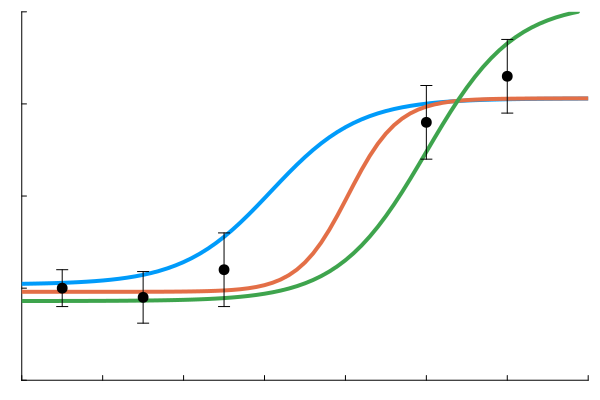
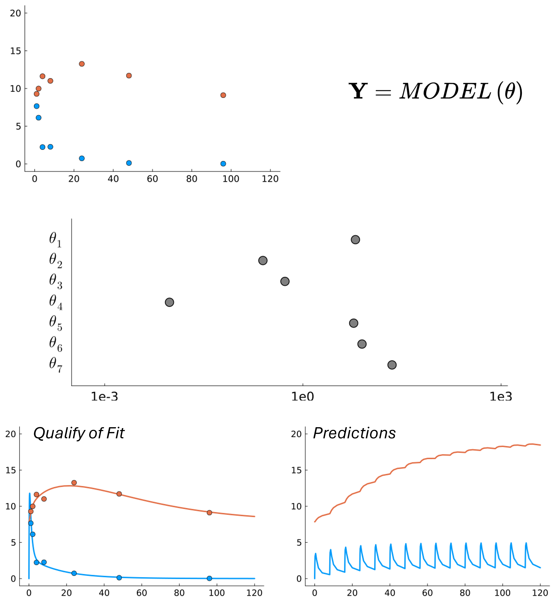
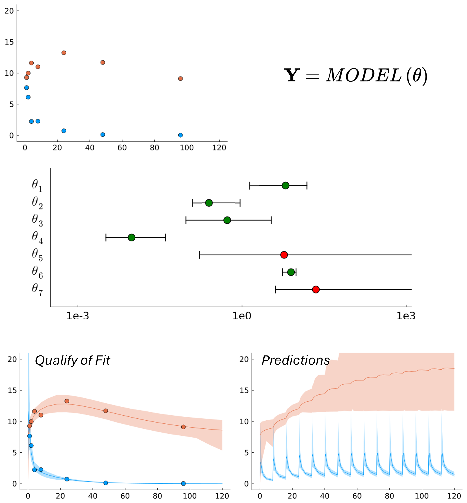
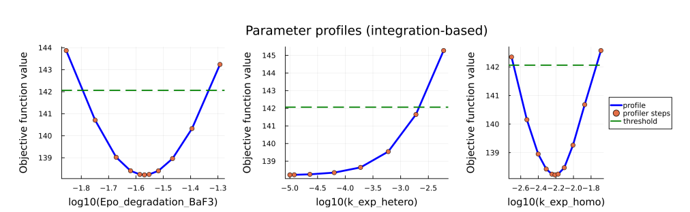

## The Illusion of Certainty

✓  The optimizer stopped without warnings.  
✓  The simulated curves match the experimental data.  
✓  Residuals look acceptable.
✓  A final set of parameter values is reported.
✓  Predictions are generated and plotted.

From a workflow perspective, everything seems complete. The calibration step is done, the numbers are fixed, and the model appears ready for interpretation or decision-making. It feels deterministic: one model, one parameter set, one set of predictions.

This is the point where many modeling projects move forward.

The optimizer may settle at one acceptable solution among many equivalent ones. A good fit does not prove that the parameters are well constrained by the data. The reported parameter values represent one possible explanation of the data, not necessarily a unique explanation.

The final parameter table may give a false impression of precision. What looks like certainty may, in fact, be an illusion.

_**Point estimates workflow**. Calibration produces a stable fit and a single set of parameter values. However, without identifiability analysis, the uniqueness and robustness of this solution remain unknown._

## Why Optimization Hides the Problem

Parameter estimation in nonlinear models is an inverse problem: we try to estimate parameter values from observed outcomes. In general, inverse problems do not guarantee a unique solution. Different parameter values, or different combinations of parameters, can reproduce the data equally well, or very close to it.

Parameters may be correlated, partially redundant, or only weakly influential within the range supported by the data. As a result, several distinct parameter sets can produce nearly identical fits. An optimizer will return one of them, depending on initialization, algorithmic details, and numerical tolerances.

If we report only that single solution, we implicitly assume that the parameters are well determined. But without assessing the width of the admissible region (whether a finite confidence interval exists at all) this assumption may be false. The true parameter values consistent with the data may lie far from the reported point estimate.

Because nonlinear models often contain many interacting parameters, it is rarely possible to anticipate in advance which ones are tightly constrained and which are not. Optimization alone does not answer that question.

## What Is Practical Identifiability?

Practical identifiability is not about finding a single best-fit parameter set. It is about understanding the range of parameter values that are still consistent with the observed data.

Instead of asking, "What are the optimal parameters?", we ask a different questions:
- How far can each parameter move before the model no longer agrees with the data?
- What are the extreme parameter values that still provide an acceptable fit?
- What are the limits of the admissible parameter space?

In this sense, identifiability analysis explores the geometry of the admissible parameter space. For each parameter, it reveals whether a finite confidence interval exists, how wide it is, and whether it remains bounded or extends indefinitely. A parameter is considered practically identifiable if its admissible region is compact and well constrained by the data.

Beyond individual intervals, identifiability analysis also exposes correlations and compensatory relationships between parameters. Directions in parameter space where changes can offset each other without degrading the fit.

Importantly, these properties reflect the structure of the data-model combination. They are far less dependent on the specific optimization algorithm or on which local minimum was found. Identifiability analysis characterizes the landscape around solutions, not just a single point.

## What Does Identifiability Analysis Give Us?

Once identifiability analysis is performed, the model stops being just a calibrated object and becomes a quantified one.

If all parameters turn out to be practically identifiable - meaning their confidence intervals are finite and reasonably compact - this tells us:
- The available data constrain the parameters sufficiently.
- The chosen parametrization is appropriate.
- The calibration result is stable, not accidental.
- Predictions derived from the model can be accompanied by meaningful uncertainty bounds.

This is the best-case scenario. It does not mean the model is "true" but it means the parameter estimates are genuinely supported by the data.

If some parameters are weakly identifiable or non-identifiable, the analysis still provides actionable information. Several strategies become available:

- **Fix and document** poorly identifiable parameters, reducing the model to a reliably constrained core.
- **Reparametrize or group** parameters, replacing unstable individual quantities with more robust composite ones.
- **Augment the data**, either by incorporating information from the literature or by designing additional experiments.
- **Use model-driven experimental design**, targeting conditions that improve identifiability.
- **Assess impact on predictions**, determining whether weakly identifiable parameters actually influence the outputs of interest.

In any case, identifiability analysis eliminates false confidence. It clarifies what is supported by data and what is not, reducing the risk of unpleasant surprises when predictions fail.

Despite being conceptually well established, identifiability analysis is still not routinely included in many modeling workflows. Time pressure, computational cost, and lack of accessible tools often push it aside in practice.

_**Identifiability-aware workflow.** By estimating parameter confidence intervals and propagating uncertainty to model outputs, we distinguish well-identified parameters from weakly identifiable ones. This leads to prediction bands that are narrow where the data constrain the model and wide where they do not._

## Fisher Information Matrix and Its Limitations

A widely used approach to assessing identifiability is the **Fisher Information Matrix (FIM)**. It evaluates local sensitivity of the model output to parameter changes near the optimum and is often available as part of standard maximum likelihood estimation. Because it is computationally efficient, it is commonly used as a quick diagnostic of parameter identifiability.

However, the FIM is inherently local. It relies on a quadratic approximation of the likelihood surface around the optimum and may not capture flat directions, strong nonlinearities, or extended regions of near-equivalent solutions. As a result, it can miss important aspects of parameter uncertainty in complex nonlinear models.

To overcome these limitations, **likelihood-based methods** that explore the objective function beyond the immediate neighborhood of the optimum provide a more informative assessment. By examining how far parameters can vary while maintaining agreement with the data, these approaches offer a more complete view of practical identifiability.

## Profile Likelihood Methods

Likelihood-based approaches provide a principled way to assess practical identifiability. Instead of relying on local curvature near the optimum, they examine how the objective function changes as individual parameters are systematically varied. This reveals whether confidence intervals are finite and how strongly parameters are constrained by the data.

In practice, these methods are more computationally demanding and require careful implementation, which has limited their routine use in many modeling workflows.

To make such analyses more accessible, we developed an open-source Julia package, [LikelihoodProfiler.jl](https://github.com/insysbio/LikelihoodProfiler.jl). It implements several profile-likelihood strategies within a unified workflow, including optimization-based, integration-based, and constrained-optimization (CICO) approaches. A detailed description of the methodology and software is available in our recent JOSS publication (https://doi.org/10.21105/joss.09501).

_**Profile likelihood examples generated with [LikelihoodProfiler.jl](https://github.com/insysbio/LikelihoodProfiler.jl).** By tracing the objective function beyond the optimum, these profiles expose the curvature and extent of the admissible parameter region. The threshold crossing determines finite or non-finite confidence intervals._

## Conclusion: A Shift in Mindset

Nonlinear modeling is inherently challenging, especially when it involves solving inverse problems and estimating multiple interacting parameters. Once a model fits the data well, there is a natural temptation to move directly to interpretation and prediction.

However, optimal parameter values represent only part of the information contained in the data. Identifiability analysis reveals how strongly those values are supported and what constraints the data truly impose on the model. This distinction is essential for building trust in model-based conclusions and for making informed decisions.

Importantly, even weakly identifiable parameters do not automatically invalidate a model. When handled carefully, models with partial ambiguity can still provide useful insights. The key is to understand what is well constrained and what is not.

Today, practical tools make it possible to include identifiability analysis as a routine part of the modeling workflow rather than an afterthought.
